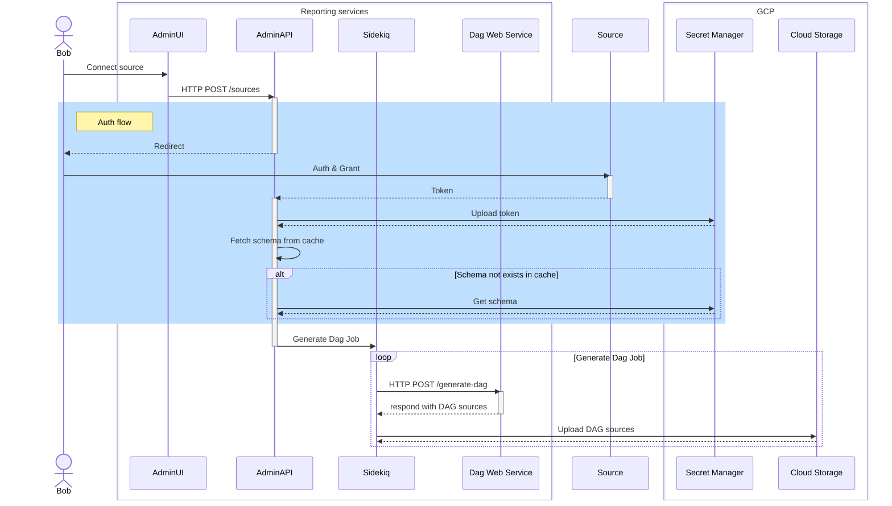

```mermaid
  %%{init: { 'theme':'default' } }%%
  sequenceDiagram

    actor Bob

    box Reporting services
        participant UI as AdminUI
        participant AA as AdminAPI
        participant S as Sidekiq
        participant DG as Dag Web Service
    end

    participant SM as Source

    box GCP
        
        participant SEC as Secret Manager
        participant CS as Cloud Storage
    end

    Bob ->> UI: Connect source
    UI ->> AA: HTTP POST /sources
    activate AA
    rect rgb(191, 223, 255)
        note right of Bob: Auth flow
        AA -->> Bob: Redirect
        deactivate AA
        Bob ->> SM: Auth & Grant
        activate SM
        SM -->> AA: Token
        deactivate SM
    

    activate AA
    AA ->> SEC: Upload token
    SEC -->> AA: 
    AA ->> AA: Fetch schema from cache
    alt Schema not exists in cache
        AA ->> SEC: Get schema
        SEC -->> AA: 
    end
    end

    AA ->> S: Generate Dag Job
    deactivate AA

    loop Generate Dag Job
        S ->> DG: HTTP POST /generate-dag
        activate DG
        DG -->> S: respond with DAG sources
        deactivate DG
        S ->> CS: Upload DAG sources
        CS -->> S: 
    end
```

